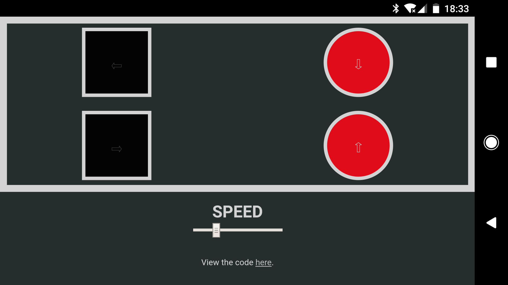

# Tessel 2 Nodebot Racer Build
This is the code for a Node Bot racer build I worked on during Node Bots Day 2017 in Houston, Texas. It runs on a Tessel 2 and allows a user connected to its access point to control the direction and speed of two attached DC motors.


## Hardware Requirements
In order to utilize this project you'll need a Tessel 2 and two DC motors. What you attach to the motors is up to you, but some wheels are probably what want.


## Software Requirements
#### Node Version
This project requires NodeJS version `4.5.0`, if you have `nvm` installed you can simply run `nvm  use` within the project directory to switch versions.

#### t2-cli and Firmware
You'll need version `0.1.4` of the `t2-cli` package. This can be installed by running `npm install -g t2-cli@0.1.4` in your terminal. With it installed you'll need to push version `0.0.16` of the Tessel 2 firmware to the board, this can be done by running `t2 update --force -v 0.0.16`.

#### Depencanies
You'll also need to run `npm install` within the project directory to download the required dependencies.


## Setup
With your Tessel 2 connected to your computer via USB run the following in your terminal.

```
# Confirm your Tessel 2 can be seen
$ t2 list

# Rename the Tessel, replace <name> with whatever you want
$ t2 rename <name>

# Provision the Device
$ t2 provision

# Setup an Access Point, repalce name and password with whatever you want
$ t2 ap -n Name -p Password

# Push the project files to the Tessel
$ t2 push bot.js
```

Once the files are done pushing to the Tessel you can now unplug the Tessel from your device and instead rely on battery power.


## Controls
Using your device connect to the access point you created during the setup instructions and navigate your browser to the IP that was logged to the terminal when you pushed `bot.js` to the Tessel. If everything was succesful you should now see the robot web controller.

The web controller has a set of simple commands for you to control the robot. 

```
Up Arrow: Moves the robot forward.
Down Arrow: Moves the robot back.
Right Arrow: Moves the robot to the right.
Left Arrow: Moves the robot to the left.
Speed Slider: Adjusts the speed of the motors from a range of 150 to 255.
```



## Credits
This project was built with the assistance of examples provided by the [NodeJS Houston community](http://www.nodejshouston.com/).
